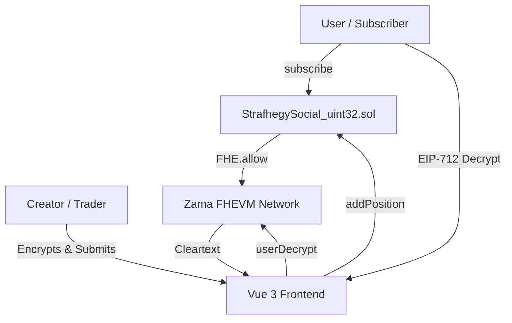
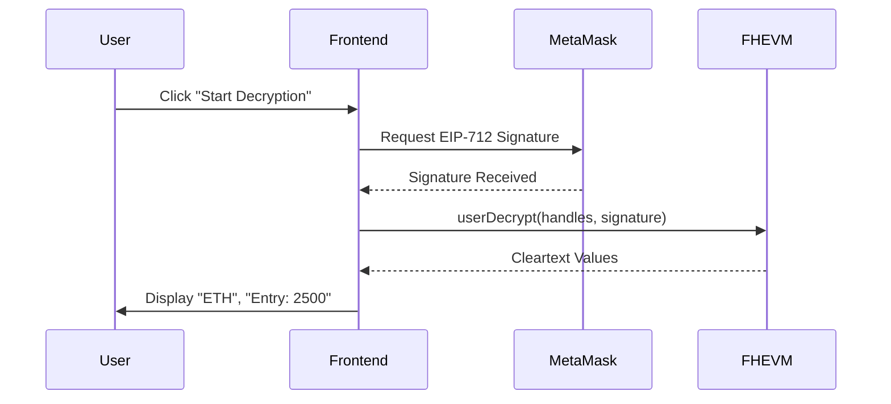

# 🏰 Strafhegy: Privacy-Preserving SocialFi

Strafhegy is a decentralized SocialFi platform built on **FHEVM (Zama)** that allows traders (Creators) to share their strategies while keeping the actual position details (Coin, Entry, Target) fully encrypted on-chain. Only active subscribers can decrypt and view these positions.


## 🚀 Key Features

- 🔐 **On-Chain Encryption**: Trading positions are stored as `euint32` (encrypted uint32) using Fully Homomorphic Encryption.
- 💳 **Subscription-Gated Access**: Creators set a monthly fee in ETH. Users must subscribe to gain decryption rights.
- 🕵️ **Privacy First**: Even the contract owner or the network validators cannot see the raw position data.
- 🕹️ **Retro Aesthetic**: A unique Windows 98/XP inspired UI for a nostalgic "Terminal" feel.

---

## 🛠 Technical Architecture

### System Overview



### Tech Stack
- **Frontend**: Vue 3 (Composition API), Vite, Ethers.js v6, Tailwind CSS.
- **FHE SDK**: `@fhevmjs` (Zama Relayer SDK) for client-side encryption and decryption.
- **Backend**: Solidity 0.8.24, `@fhevm/solidity` library.
- **Network**: Sepolia Testnet (with FHEVM support).

---

## 🔒 FHEVM Workflow

### 1. Encryption (Creator Side)
When a creator adds a position, the frontend uses the Zama SDK to encrypt the values locally before sending them to the blockchain.

```typescript
// Example of client-side encryption
const fhe = getFheInstance();
const input = fhe.createEncryptedInput(contractAddress, userAddress);
input.add32(coinCode); // e.g. "ETH" encoded as ASCII
input.add32(entryPrice);
const { handles, inputProof } = await input.encrypt();

// Submit to contract
await contract.addPosition(handles[0], handles[1], ..., inputProof);
```

### 2. On-Chain Logic
The smart contract receives `externalEuint32` handles and converts them to internal `euint32` types. It then manages permissions using `FHE.allow`.

```solidity
function addPosition(...) external {
    Position memory p;
    p.coinCode = FHE.fromExternal(coinCodeEnc, inputProof);
    // ...
    FHE.allow(p.coinCode, msg.sender); // Creator can always see it
    _positions[msg.sender].push(p);
}
```

### 3. Decryption (Subscriber Side)
Subscribers must request a decryption token (EIP-712 signature) to view the cleartext data.



---

## 📜 Smart Contract API

### Creator Functions
- `upsertProfile(uint256 priceWei, bool active, string username)`: Initializes or updates a creator's profile.
- `addPosition(...)`: Adds a new encrypted position. Requires an FHE input proof.
- `updatePositionStatus(uint256 positionId, ...)`: Closes a position by updating its status to encrypted "1".

### Subscriber Functions
- `subscribe(address creator) external payable`: Pays the monthly fee to the creator and grants subscription rights.
- `grantAccess(address creator, uint256[] ids)`: Explicitly grants FHE decryption permissions for specific positions to the subscriber.
- `refreshAccess(address creator)`: Batch grants access to the latest 5 positions.

### View Functions
- `getPosition(address creator, uint256 id)`: Returns the encrypted handles for a position.
- `getAllCreators()`: Returns a list of all active creators.

---

## 📦 Project Structure

```
.
├── strafhegy-backend/       # Hardhat project, Solidity contracts
│   ├── contracts/           # FHEVM Smart Contracts
│   └── scripts/             # Deployment & Task scripts
├── strafhegy-frontend/      # Vue 3 project
│   ├── src/
│   │   ├── components/      # UI Components (Windows 98 style)
│   │   ├── fhevm/           # Zama SDK wrappers & state
│   │   └── composables/     # Shared logic (useStrafhegy)
└── README.md                # This file
```

---

## 🛠 Installation & Setup

### Backend
```bash
cd strafhegy-backend
npm install
# Compile contracts
npx hardhat compile
# Deploy to Sepolia
npm run deploy:sepolia
```

### Frontend
```bash
cd strafhegy-frontend
npm install
# Run development server
npm run dev
```

---

## 📄 License
MIT License. Built with ❤️ for the Zama FHEVM ecosystem.
