# Strafhegy: Encrypted SocialFi 🛡️


> **"Share Alpha. Keep Privacy."**

**Strafhegy** is a decentralized trading platform built on **Zama FHEVM**, allowing creators to share on-chain strategies that are **mathematically proven to be encrypted**.

**How to Use Strafhegy**
**1. Getting Started**
Connect Wallet: Click the button in the top-right corner.
Network: Ensure you are on the Sepolia testnet. The app will initialize the Zama FHEVM automatically.

**2. For Creators (Traders)**
Set Up Profile:
Go to your card (first one on the left).
Set a Monthly Fee (e.g., 0.005 ETH) and click Save Profile.
Share a Strategy:
Enter the Coin (e.g., ETH), Expectation (Long), Entry Price, and Target.
Click Add Position.
Result: Your position is encrypted and stored on-chain. Nobody (not even the devs) can see the raw values yet.

**3. For Subscribers (Users)**
Subscribe:
Find a Creator in the list.
Click Subscribe and pay the monthly fee.
Decrypt & View:
Click Start Decryption.
Sign the EIP-712 request in your wallet (this proves you are authorized).
Result: The proprietary "Entry" and "Target" prices are revealed only to you!

**4. Managing Positions**
Close Position: Creators can click "Close" to end a trade signal.
Refresh: Subscribers should click "Refresh" to sync the latest encrypted logic from the chain.

---

## 📊 Comparison: Why Strafhegy?

| Feature | 🐢 Traditional SocialFi | 🚀 Strafhegy (FHE) |
| :--- | :--- | :--- |
| **Data Visibility** | Public (Plaintext) | **Encrypted (Ciphertext)** |
| **MEV Protection** | ❌ Vulnerable to Sandwich Attacks | ✅ **Front-running Resistant** |
| **Monetization** | Easily bypassed (Copy-trading) | 🔒 **Strictly Enforced on Chain** |
| **Trust** | "Trust me bro" screenshots | 📜 **Verifiable On-Chain History** |
| **UX** | Standard/Boring | 💾 **Retro Windows 98 Style** |

---

## 🗺️ Ecosystem Architecture

```mermaid
graph TD
    subgraph "Client Layer (Vue 3)"
        UI[🖥️ Retro UI]
        SDK[🔐 Zama Client SDK]
    end

    subgraph "Blockchain Layer (Sepolia)"
        SC[📜 Strafhegy Contract]
        FHE[☁️ FHEVM Coprocessor]
    end

    User((👤 Subscriber)) <-->|1. Interact| UI
    Creator((👩‍💻 Creator)) <-->|1. Interact| UI

    UI -->|2. Encrypt/Decrypt| SDK
    SDK <-->|3. Submit Ciphertext| SC
    SC <-->|4. Compute/Re-encrypt| FHE
```



---

## 🔄 User Flow: The "Alpha" Lifecycle

Instead of reading lengthy paragraphs, follow the data flow below:

```mermaid
sequenceDiagram
    autonumber
    actor Alice as 👩‍💻 Creator
    participant App as 🖥️ Strafhegy App
    participant Chain as ⛓️ Smart Contract
    participant Zama as ☁️ FHEVM Network
    actor Bob as 👤 Subscriber

    Note over Alice, Zama: 🟢 PHASE 1: Creation & Encryption
    Alice->>App: Input Strategy (Long ETH @ $2500)
    App->>App: Encrypt Client-Side (Create Handles)
    App->>Chain: addPosition(encryptedHandles)
    Chain->>Zama: Store Ciphertext (Nobody can read this)

    Note over Bob, Zama: 🟠 PHASE 2: Subscription
    Bob->>Chain: Subscribe (Pay 0.005 ETH)
    Chain->>Chain: Verify Payment
    Chain->>Zama: FHE.allow(Bob, Alice's Data)
    Note right of Zama: Access Granted On-Chain ✅

    Note over Bob, Zama: 🔵 PHASE 3: Decryption
    Bob->>App: Click 'Decrypt'
    App->>Bob: Request Signature (EIP-712)
    Bob->>App: Sign Request
    App->>Zama: userDecrypt(handles, signature)
    Zama->>App: Return Re-encrypted Data
    App->>Bob: Show "Long ETH @ $2500"
```



---

## 🧩 Data Privacy Model

How we handle your secret data states:

| State | Who Can Read? | Technical Type |
| :--- | :--- | :--- |
| **At Rest (On-Chain)** | 🚫 **NOBODY** (Not even validators) | `euint32` |
| **In Transit** | 🚫 **NOBODY** (Encrypted Handles) | `bytes` |
| **Post-Decryption** | ✅ **Authorized Subscriber Only** | `uint32` (Client-side) |

```mermaid
stateDiagram-v2
    [*] --> PlaintextInput
    PlaintextInput --> EncryptedHandle: 🔐 Zama SDK Encrypt
    EncryptedHandle --> OnChainStorage: Transaction
    OnChainStorage --> AccessCheck: ❓ Decorator View
    
    state AccessCheck {
        (*) --> CheckPayment
        CheckPayment --> GrantAccess: Paid ✅
        CheckPayment --> DenyAccess: Unpaid ❌
    }

    GrantAccess --> ReEncryption: 🗝️ KMS Re-encrypt
    ReEncryption --> DecryptedView: User's Browser
    DenyAccess --> [*]: Access Denied
```



---

## 🛠 Tech Stack & Tools

| Component | Technology | Purpose |
| :--- | :--- | :--- |
| **Frontend Framework** |  | Reactive UI Component Architecture |
| **Build Tool** |  | Fast HMR and Building |
| **Smart Contracts** |  | Business Logic & Access Control |
| **Encryption** | **Zama FHEVM** | Homomorphic Encryption Operations |
| **Interaction** | **Ethers.js v6** | Wallet Connection & Contract Calls |

---

## 📂 Project Structure


graph LR
    Root[📂 Strafhegy] --> FE[📂 strafhegy-frontend]
    Root --> BE[📂 strafhegy-backend]
    
    FE --> Components[🧩 /components<br/>(Retro UI)]
    FE --> FHE[🔐 /fhevm<br/>(SDK Logic)]
    
    BE --> Contracts[📜 /contracts<br/>(Solidity)]
    BE --> Scripts[⚙️ /scripts<br/>(Deploy)]


---

## ⚡ Quick Start

### 1. Installation
```bash
git clone https://github.com/tg382018/strafhegy.git
```

### 2. Launch Backend
```bash
cd strafhegy-backend
npm install
npx hardhat compile
npm run deploy:sepolia
```

### 3. Launch Frontend
```bash
cd strafhegy-frontend
npm install
npm run dev
```

---

## 📄 License
MIT License. Built for **Zama** Developer Program.
